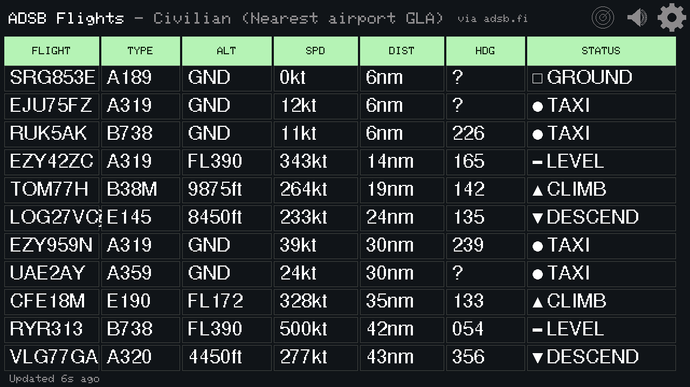
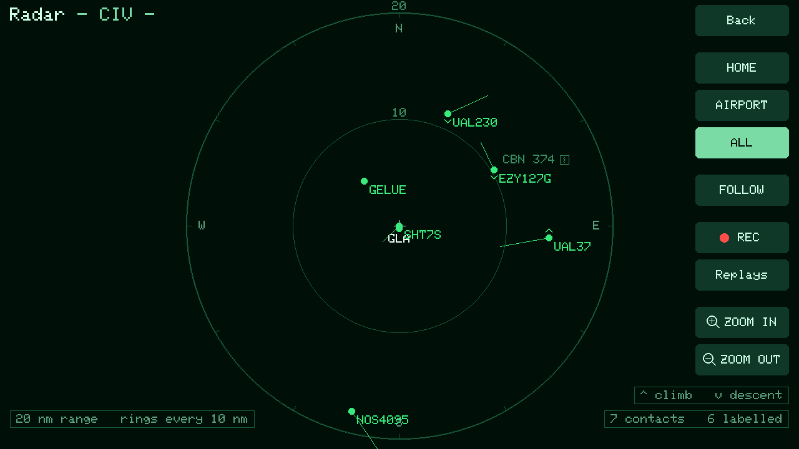
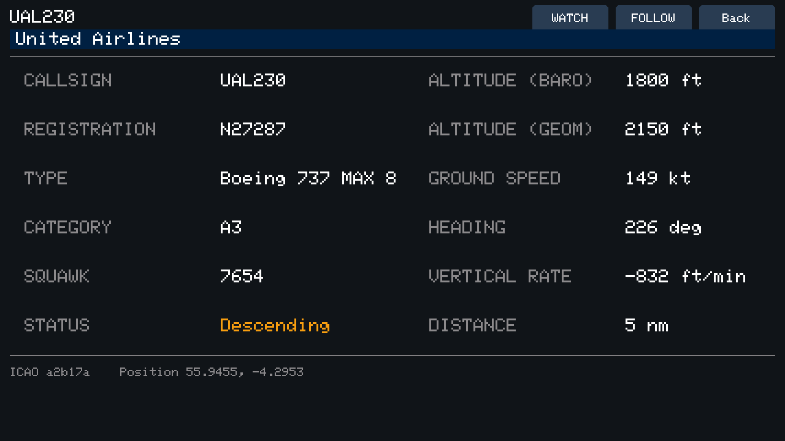
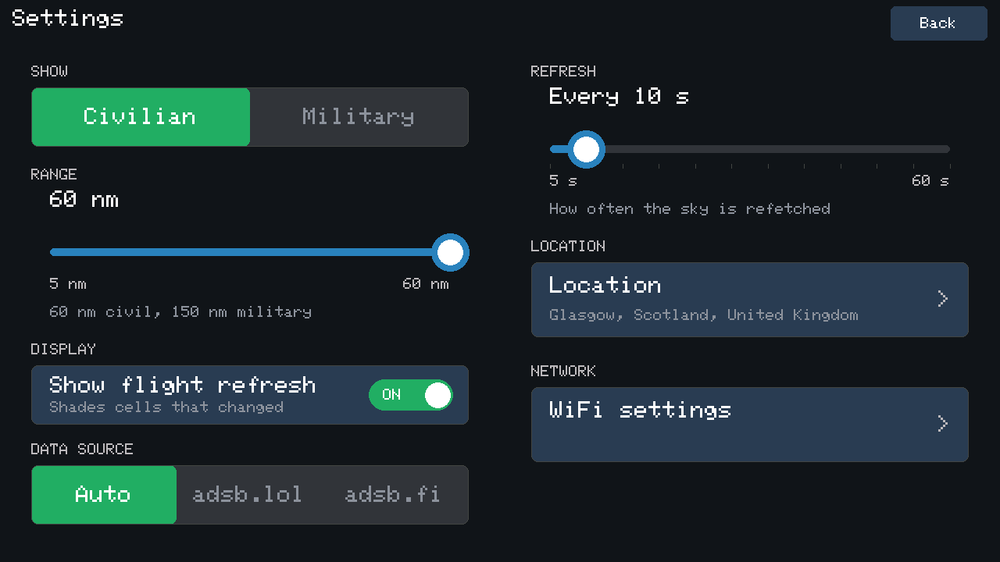
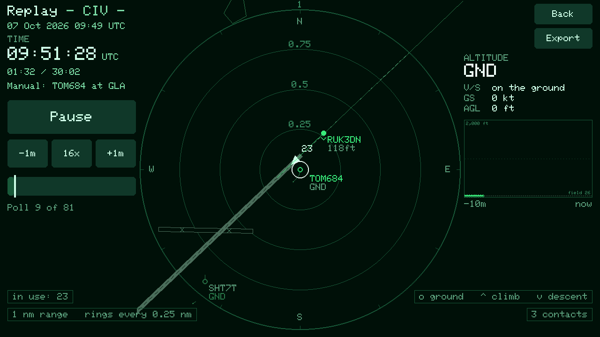
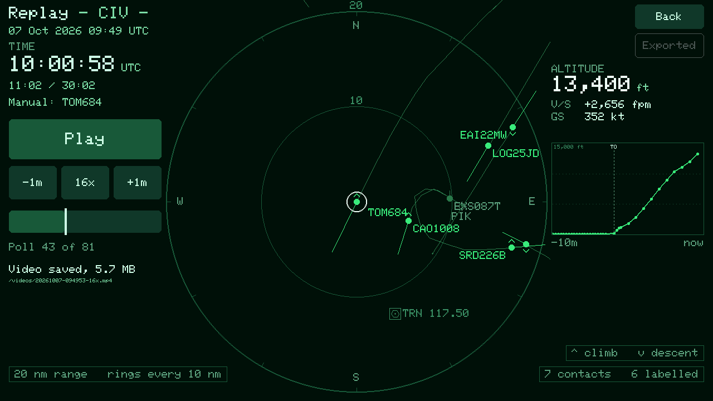
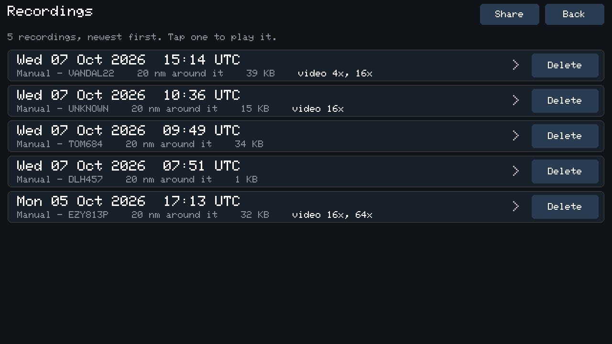
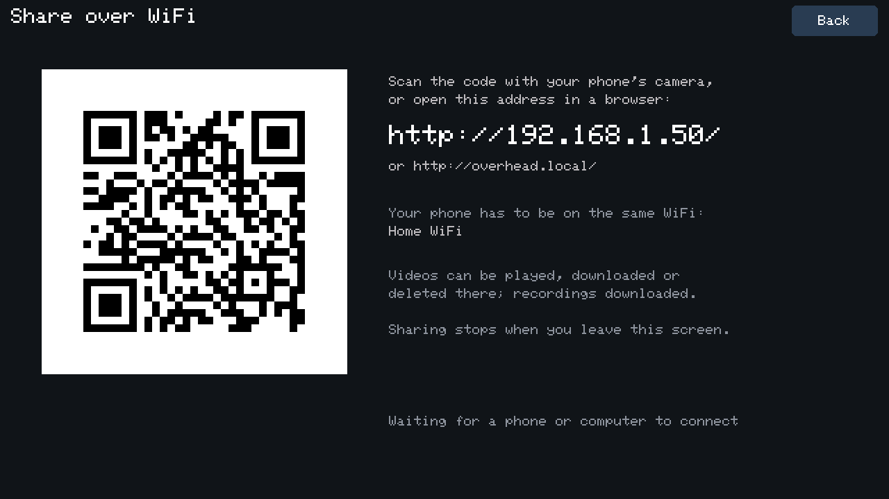

# Overhead (C++)

A C++ rewrite of [Overhead](https://github.com/craigdianesmith-glitch/tab5-adsb-flight-tracker-micropython), a live ADS-B flight tracker for the [M5Stack Tab5](https://docs.m5stack.com/en/core/Tab5). Built on PlatformIO + Arduino + M5Unified/M5GFX (no LVGL), with genuine multithreading: the network fetch runs on its own FreeRTOS task pinned to core 0, so the UI never blocks - the thing that wasn't possible on the MicroPython version, where sockets couldn't be created from a secondary thread at all.

| | |
| --- | --- |
|  |  |
|  |  |
|  |  |
|  |  |

Captured from the device with `tools/screenshot.py` - see [Screenshots](#screenshots). The address and network name on the share screen are placeholders.

## Hardware

- M5Stack Tab5 (5" 1280x720 touchscreen, ESP32-P4 + ESP32-C6)

## Toolchain

Tab5's ESP32-P4 isn't supported by mainline PlatformIO yet - this uses the community [`pioarduino`](https://github.com/pioarduino/platform-espressif32) fork of the espressif32 platform (see `platformio.ini`).

```
pip install platformio
```

## Setup

1. Copy `include/secrets.h.example` to `include/secrets.h` (it is gitignored). Filling in WiFi credentials there is optional: a build left with the placeholder opens the WiFi screen on boot and takes a network on-screen instead, which is how a device flashed from a released image is expected to be set up. Credentials compiled in here are only ever a fallback for a device that has never been given one that way.
2. Build and flash:
   ```
   pio run -t upload --upload-port /dev/ttyACM0
   ```
   An image to publish is built with `pio run -e release` instead, into `.pio/build/release/firmware.bin`: the same firmware without `include/secrets.h`, so the credentials of whoever built it never reach it, and it opens the WiFi screen on first boot. The libraries are pinned to the commits it was tested against.
3. Watch serial output at 115200 baud for boot/WiFi diagnostics if anything looks wrong. Once a minute it also logs a `[perf]` line: how long the radar and zoom took to draw - split into the parts that don't move from frame to frame, the contacts, and the push to the panel - the longest pass of the main loop, and how much internal RAM is free. Measured on the radar and zoom at Glasgow: about 40-50ms a draw, of which 8ms the scope, airports and runways, 1ms the contacts and 19ms the push - too little in the unmoving parts for caching them to be worth its keeping in step.

## Screenshots

The Tab5 has no screenshot function of its own, but everything on screen is drawn into a landscape canvas in PSRAM before the PPA rotates it onto the panel - so the firmware answers a `##S` on USB serial with that canvas, and `tools/screenshot.py` turns it into a PNG:

```
pip install pyserial pillow
python tools/screenshot.py radar.png
```

It is pixel-exact and the right way up whatever the device's orientation, and takes about three seconds. Close any serial monitor first. The script leaves DTR and RTS as the kernel sets them on open: clearing DTR while RTS is still raised is the ESP32's USB-serial reset signal, which is what pyserial's usual `dtr = False` sends. And it checks that the end marker follows the last pixel exactly, retrying if a log line from the poll task landed mid-transfer and shifted the image.

## Notable hardware quirks this project works around

- **WiFi**: Tab5's WiFi lives on a separate ESP32-C6 co-processor reached over SDIO. The generic P4 eval-board pin defaults don't reach it, so `hostedSetPins(12, 13, 11, 10, 9, 8, 15)` must be called before WiFi initializes (see `main.cpp`). M5Unified is supposed to do this automatically in `M5.begin()`, but it's called explicitly here too.
- **Flash partitioning**: the board's default Arduino partition scheme reserves a tiny (~1.3MB) app partition despite 16MB of flash. `partitions_custom.csv` gives the app a single ~14MB partition instead (no OTA needed for this project).
- **HTTPClient's User-Agent**: `HTTPClient::addHeader("User-Agent", ...)` is silently overridden by an internal default (`ESP32HTTPClient`) - use `setUserAgent()` instead. adsb.lol rejects generic User-Agents outright.
- **mbedTLS stack size**: the background poll task needs a considerably larger stack (16KB) than a typical FreeRTOS task, or HTTPS requests fail silently.
- **Speaker startup**: `M5.begin()` configures the Tab5's ES8388 codec and enables its amp, but stops short of starting the I2S output - nothing is audible until `M5.Speaker.begin()` is called as well (see `src/sound.cpp`).
- **H.264 encoder input**: this board's P4 is an early revision (v1.x - the board definition builds against the `esp32p4_es` libraries), and on those the hardware H.264 encoder takes only its own packed YUV 4:2:0 layout (`O_UYY_E_VYY`: odd lines U Y Y, even lines V Y Y), not the RGB565 the canvas holds. The PPA converts into it - see [Video export](#video-export). And `esp_h264_alloc.h` has no `extern "C"` guard, so its allocators don't link from C++; `heap_caps_aligned_calloc` does the same job.
- **Rotated framebuffer**: the panel is physically 720x1280 portrait, so in the landscape orientation this app runs at, every horizontal line of the UI is a *column* in memory. LovyanGFX's rotated `pushSprite` can't memcpy in that case and walks the image pixel by pixel - a full-screen push measures **650ms** on this device. `src/screen.cpp` hands the rotation to the ESP32-P4's PPA (its 2D graphics accelerator) instead; see below.

## Header

The left of the bar says what is being shown, where from, and who it came from - `ADSB Flights - Civilian (Nearest airport GLA)   via adsb.lol` - and the right carries the three controls: radar, mute, and the cog. The airport is the nearest one to the configured location from the same table the radar centres on, and is left off entirely when nothing is within range of it.

The source is named because it can change on its own: under **Auto** the tracker fails over between providers, and a table quietly being served by the other one should say so rather than leave it to be guessed. It appears once a poll has succeeded, and changing it forces the repaint that draws it.

The controls sit together at the right edge rather than scattered across the bar, which leaves the whole left side to that one line. Muting is a header control rather than a settings one because it is the thing most likely to be wanted in a hurry.

## The table

Seven columns: flight, type, altitude, speed, distance, heading and status.

Altitude is given in feet up to 9999 and as a flight level above that - `FL200` for 20000ft, hundreds of feet as the convention has it. Past ten thousand the exact figure is neither how the altitude gets referred to nor worth the width of five digits, and the column is narrower for it.

Heading is the reported ground track in three digits, `035` rather than `35`, the way a heading is written and spoken. Status carries a drawn icon ahead of its word, so the column reads at a glance without the text having to be parsed.

Widths are fixed rather than measured: the content of each column is known and bounded - eight characters of callsign, four of designator, five of flight level - so there is nothing to be gained from measuring at runtime, and a table whose columns don't move between refreshes is easier to read. They are sized against the widest realistic value in each column, in the table's font: FLIGHT fits eight `W`s, the widest callsign there can be (272px), where it used to be too narrow for `LOG27VQ`; STATUS fits `DESCEND` behind its icon; HDG never holds more than three digits, and had been given room for seven. A value that is still too wide is drawn at a smaller size until it fits, rather than running over the border into the next cell.

A callsign the transponder sent as blank arrives from readsb as a row of `@`s. Those are stripped, and one that was nothing else shows as `UNKNOWN`; an aircraft with no callsign field at all is shown by its ICAO hex, as before.

## Settings

The cog opens a settings screen in two columns - eight controls will not stack down 720px of height, and 1280px of width was going spare:

Its title bar has the version beside the title, and **Help** and **About** beside Back. **Help** is two pages on how to use the tracker - the table, radar, airport zoom, following, alerts, recording and settings - and **About** the version, a disclaimer (for interest only, not for navigation or anything safety depends on; the data can be incomplete or wrong; take-offs, landings and the spoken clearances are simulated) and the credits for the data, voice and libraries. Both are `src/info_screen.cpp`, written as headings, paragraphs and bullets and wrapped and paged to fit when opened, so the words can change without anything being counted.

- **Traffic filter** - civilian or military, as an either/or choice rather than two independent switches. Military aircraft are the ones readsb sets bit 0 of `dbFlags` on - or, on a feed that doesn't carry that field, the ones a military-only endpoint returned.
- **Range** - a slider whose ceiling follows the filter above it: 60nm for civil traffic, 150nm for military, since military traffic is worth watching further out. Switching to civil with the slider up high clamps it back down.
- **Show flight refresh** - whether cells that changed on the last poll are shaded for a moment (see Rendering below). On by default.
- **Navaids** - whether the radar marks the VORs, DMEs and TACANs in range (see [Radar](#radar)). On by default.
- **Data source** - which provider to poll: **Auto**, or one of them pinned. Auto is the default and the reason this control exists - see [Data sources](#data-sources). Pinning is for when you would rather know which one you are looking at than have it chosen for you; a pinned provider's empty answer is reported as it stands, with no second opinion sought.
- **Refresh interval** - how often the sky is refetched, from 5 to 60 seconds in fives, defaulting to 30. The slider is stepped rather than continuous, with a detent mark per position, so it can't be left on a value nobody asked for. Below five seconds the endpoint starts refusing; past a minute the table is stale enough that a slower dial wouldn't be asked for. The default is deliberately not the fastest the dial allows - see [Data sources](#data-sources).
- **Location** - the place search, which used to be a button filling half the main header. It is a setting rather than a permanent fixture of the table: it gets changed once when the device moves and then not again. Both finishing and cancelling return here rather than to the table, so a new location lands you back on the button that shows it took.
- **WiFi** - scans for networks and connects to one, so the device can move between networks without a reflash. Credentials are saved to NVS and win over the ones compiled in from `secrets.h`, which stay as the fallback for a device that's never had WiFi set on-screen. They are saved only once they have connected: saved up front, one mistyped password - or a tap on the neighbour's network - replaced those of the network that was working. A passphrase too short for WPA (or WEP) is refused before anything is tried. A device with no credentials at all - a fresh flash of a released image - opens this screen on boot rather than spending the connect timeout proving it has nothing to connect with, and Back from there lands on the table.

  A network that goes away is retried from the poll task, since being thrown into setup over a router reboot would be worse than the status line saying what is happening - but not indefinitely. Three failed attempts in a row, the boot connect included, is about a minute, and past that the network is taken to be gone rather than blipping (a phone's hotspot switched off, the device carried somewhere else): this screen opens, saying which network couldn't be reached, so another can be picked, and once one connects it goes straight back to the table. Only from the table, the radar or the detail screen - not from a replay or a half-typed watchlist, which don't need the network.
- **Alerts & recording** - which of the four alert kinds are on, whether an alert starts a recording, and the watchlist. See [Alerts](#alerts) and [Recording and replay](#recording-and-replay).

All of it persists across reboots, along with the mute state and the chosen location. Changing the filter, the range or the source refetches immediately rather than waiting out the rest of the interval; changing the interval itself doesn't - the new value simply applies to the wait already running, including shortening one in progress.

## Polling

These endpoints return around forty fields per aircraft and this app reads fifteen, so the fetch hands ArduinoJson a `DeserializationOption::Filter` and the rest are skipped in the tokeniser rather than allocated into the document and then ignored. Where the response declares a `Content-Length` the document is parsed straight off the socket; where it doesn't, it goes through `getString()` first, because `HTTPClient` de-chunks on the `getString()`/`writeToStream()` paths but *not* on the raw stream - a chunked reply read directly still has the chunk headers in it.

The HTTPS client is held for the life of the firmware rather than built per fetch, with `setReuse(true)`, so the socket stays open between polls and each fetch skips DNS, TCP and the TLS handshake. `HTTPClient` stores the client by reference and its `clear()` touches neither the socket nor the reuse flag, so this needs nothing more than keeping both objects alive. Measured with `-DNET_PROFILE`:

| | before | after |
| --- | --- | --- |
| fetch, start to parsed | ~340ms | ~90ms |

The document itself is allocated from PSRAM through a custom `ArduinoJson::Allocator`, keeping the largest thing this task holds off the 512KB of internal RAM that the WiFi and TLS stacks compete for. PSRAM is the slower memory, so this could have cost parse time; measured, it didn't - parse sits at 25-29ms either way, because with a streaming parse that figure is mostly the body still arriving rather than the document being written. The filter document stays in internal RAM: it is a handful of keys and not worth the slower memory.

The build uses `-O2` rather than the Arduino default of `-Os`, which on a synthetic 66KB, 150-aircraft response cut the filtered parse from 79ms to 45ms. The same comparison left drawing unchanged - a full radar repaint draws in ~22ms and the table in ~44ms at either level, because writing into the PSRAM canvas is bound by the memory rather than the instructions - so the gain is the poll task's, for about 90KB of flash. The precompiled framework (WiFi, TLS, drivers) is untouched by either.

The first fetch after a boot still pays the full handshake, and a connection the far end has closed in the meantime shows up as a transport error on the next request rather than at the time it was dropped - so a *connection-level* failure retries once on a fresh socket. Only a connection-level one: a read timeout means the server has the request and is simply slow, and sending it again would put two of the same request on an endpoint that is already throttling. The read timeout is 12s rather than the 5s default for the same reason - a served request takes about 45ms, but a throttled one can take several seconds and is still worth waiting for. The standing cost is one mbedTLS context resident (about 380 bytes of static RAM here) instead of one built and torn down every ten seconds.

Providers answer `429 Too Many Requests` once they have had enough, and a poll that collects one is followed by a minute in which no request goes out to *that* provider at all, rather than by more of the same at the usual cadence. The backoff is per provider, so one throttling the device doesn't sideline the other. If 429s are a standing feature rather than an occasional one, the refresh interval in Settings is the dial to turn - a short one is not guaranteed to be within what the endpoint will serve, and a long session of reflashing (each boot polls immediately) is enough to trip it.

The kept-alive socket is closed when a poll is aimed at a different host, since reusing it would send the request down a connection to the wrong server.

The status line under the table says how old the data is, and turns amber when the last poll didn't land, so a quiet sky can be told apart from a dead network. A link that drops is reconnected from the poll task with a 5s-to-2min backoff, standing down while the WiFi screen is up, since that screen drives the radio itself; three failures in a row open that screen (see [Settings](#settings)).

## Aircraft types

The `desc` field is always null on the endpoints this uses, so the detail screen's full aircraft name is filled in locally from `src/aircraft_db.cpp`. There are two tables: civil types, and around 85 military ones covering transports, tankers, surveillance, combat, trainers, helicopters and drones.

Which is consulted first depends on the aircraft's own military flag, because a good number of ICAO designators cover both - `EC45` is an air ambulance or a US Army UH-72 Lakota, `BE20` a King Air or a C-12 Huron, `B762` a 767-200 or a KC-46 Pegasus. The other table is still searched as a fallback, so a type listed in only one resolves either way.

Every designator in both tables is checked against the ICAO doc 8643 list rather than written from memory, which is how four bad entries came to light - each one a row that could never have matched an aircraft:

| was | problem | now |
| --- | --- | --- |
| `RC135` | designators are four characters at most | `R135` |
| `TYPH` | not a designator | `EUFI` |
| `E175` | not a designator; the E175 is split by wing | `E75L` + `E75S` |
| `PA28` | not a designator | `P28A` (already present) |

## Radar

The radar button in the header opens a plan-position plot centred on the configured location, in phosphor green: range rings on round numbers, bearing marks every 30 degrees, and every contact that reported a position as a blip with a vector showing a minute of flight at its current groundspeed. A tap on a blip opens that aircraft's detail screen.

A single hue is deliberate - on a plot like this brightness is what carries meaning, which leaves it free to mark a new arrival as the brightest thing on screen.

Which is also why vertical movement is a shape rather than a colour or a shade: both of those were already spoken for, and neither was free to take on a second meaning without muddling the first. A contact that is climbing carries a chevron above the blip and one that is descending carries it below, pointing the way the aircraft is going; level and ground traffic carry nothing at all, so the plot stays quiet when nothing is doing anything vertically. The footer names the two marks rather than leaving them to be worked out, stacked above the contact count in the bottom right: the plot is still 165px wide at the footer's height, so a legend appended to the range line on the left ran straight into it. Each of the three readouts sits in its own boxed cell the way a scope's data blocks do, drawn in the same dim green as the range rings so the boxes read as furniture and the text inside them as the reading.

That is roughly what a real secondary-radar display does, for the same reason - the scopes those plots were drawn on had one phosphor and no colour to spend, so trend information went into the symbol.

A data refresh redraws only what can change: the plot square, and the footer readouts beside it. The header and the margins either side of the plot stay as they were drawn on arrival, which halves the area pushed to the panel, and the square is cleared by the PPA rather than the CPU - 15ms of `fillRect` into PSRAM, where the hardware fills the whole screen in 5. Measured with 60 contacts, a refresh went from 64ms to 41ms; arriving at the screen, or toggling its centre, is still the full 64ms repaint. Contacts are clipped to the square so that nothing is drawn outside what a refresh erases - at short range a fast aircraft's vector can otherwise run well past the outer ring.

Callsigns are placed nearest-first and one may not overlap another already placed, so in a cluster the closest aircraft keeps its label and the rest stay as bare blips. The footer says how many were plotted and how many of those are labelled, so a thinned display doesn't read as a missing one.

The code at the centre is the nearest airport, from a generated table of the 3244 large and medium airports with scheduled service in the public-domain [OurAirports](https://ourairports.com/data/) dataset (~39KB of flash). A full scan takes 6.7ms, so the result is cached until the location changes rather than recomputed per frame. Nothing within 120nm leaves the centre as a bare cross.

An alerted aircraft is drawn amber, or red for an emergency, and as its alert goes off its callsign flashes red three times - drawn even where it would otherwise give way to another label, since it is the one being pointed at. REC and Replays sit in the header; see [Recording and replay](#recording-and-replay).

The buttons stand in a column down the right-hand edge, each doing one thing on a tap - there is no long press on the radar. Under **Back**, **HOME**, **AIRPORT** and **ALL** choose the view, only the one in use lit: **AIRPORT**, the default, puts the airport nearest home at the centre with its code under the cross; **HOME** centres on the configured location itself and marks it with a bare `+`. The choice persists. Airport mode with nothing in range falls back to home. The aircraft are still fetched around home, so with the plot centred on an airport some way off, the edge of the plot furthest from home can sit beyond the fetch radius and show empty. Below them come **FOLLOW**, then **REC** and **Replays**, and last **ZOOM IN** and **ZOOM OUT**, which step the range shown through 5, 10, 15, 20, 30, 40nm and on (`RADAR_RANGE_STEPS_NM`) - at the default 25nm, the same steps as following closes in through on a landing. Inside the poll radius they change only what is shown: the poll, the table and the alerts go on covering the whole radius. **ZOOM OUT** past it widens the radius itself, as the settings slider would and as far as it goes - 60nm civil, 150nm military - saved, and shown on the settings screen; and **ZOOM IN** from 5nm opens the airport zoom of the airport at the centre - centred on home, the nearest within 5nm - with its ZOOM OUT coming back to 5nm. Either is greyed out once there is nowhere further to go, and while following, which sets its own range. The range chosen persists.

The radar and the airport zoom act on a touch as it lands rather than as it lifts. Elsewhere a tap is M5Unified's click, which only counts if the finger lifts within half a second and less than 8px from where it landed - on the radar enough taps strayed past one limit or the other that its buttons felt laggy or missed taps outright, and a tap held a moment too long on the old centre toggle toggled the airports instead. Nothing on either screen drags or holds, so nothing is lost; the rest of a touch acted on is ignored, so a tap that opens another screen doesn't go on to press whatever is under it there. Each button also takes a tap from the margin to its left and halfway into the gaps around it, and lights before the plot is redrawn.

**ALL** is the airport view with every other airport within the plot's range marked as well; HOME or AIRPORT takes them off. Each is a chart's airfield symbol - a ring with four ticks, so it can't be mistaken for a blip - with its code under it, in the dim green of the compass points and drawn before any contact, so the airports read as the map and the traffic stays on top. Codes are placed nearest-first and one that would overlap another is left off with its symbol kept, so a cluster of airfields still shows as one; callsigns don't give way to them. Over the busiest parts of the table that comes to about 25 airports at the 150nm military range, and 5 to 10 at the civil 60nm. The list comes from the same table, cached until the centre or the range changes, and the choice persists and carries over to replays.

**Navaids** - the radio beacons on an aviation chart - are marked in every view, following and replays included, unless switched off in settings: each VOR, VOR-DME, VORTAC, TACAN, DME and NDB-DME in range, as a chart draws it but small - a hexagon with a dot for a VOR, boxed for a VOR-DME; three tabs for a TACAN, round a hexagon for a VORTAC; a box with a dot for a DME, round a ring of dots for an NDB-DME - with its ident and what a pilot would dial beside it: `GOW 115.40`, an NDB-DME's NDB in kHz (`CBN 374`), a TACAN's channel (`AAL 114X`). They are drawn after the airports, in the ring labels' dimmer green, as the part of the map least often looked for. A label goes to the right of its symbol, or failing that the left, above or below - inside the outer ring and clear of every other label, every airfield and navaid symbol, the centre's cross or the followed aircraft's ring, and the ring distances and compass points - and one with no room anywhere keeps its symbol only. Each is tried first where it was on the last frame and let stay there with a little less room, so as the map moves under a followed aircraft a label that only just fits doesn't come and go a pixel at a time. One whose symbol would touch an airfield's is left off altogether: it is that airport's own, at a range where the two can't be told apart - Glasgow's GOW at 20 and 10nm - and a closer range, or the airport's zoom, has room for it. A tap on one - its label or its symbol, or picked from the list where it is among airports or traffic, as Glasgow's GOW is - puts up its card: its name, type, frequency, DME or TACAN channel, and the airport it serves; the next tap anywhere closes it. They come from OurAirports' navaids, generated by `tools/gen_navaids.py`: 4397 of them, by latitude so the radar's lookup goes straight to its band, about 200KB of flash. Plain NDBs, twice as many again and clutter round every airfield, are left out, as are the few the dataset marks closed. The airport zoom has them too, over its runways, their labels kept clear of the runways, their in-use arrows and numbers: GOW 115.40 beside Glasgow's 05/23.

**Tap an airport** - its code or its symbol, the centre's included - to zoom in on it. Where a tap reaches more than one thing - an airport under its own ground traffic, or a cluster of contacts, on the radar or in the zoom - a list of them comes up beside it, airports first and then the aircraft by callsign, type and altitude, to pick from; anywhere else, or Cancel, closes it. The zoom draws each of its runways to scale from where the dataset puts its two ends and how wide it is, with the number painted on each end just beyond it and a dashed extended centreline running on to the edge of the plot. It is centred on the middle of the runways and framed to fit them with room around for traffic on final: 2nm across for a one-runway field like Glasgow, 2.5nm for Heathrow, 4nm for O'Hare. **ZOOM IN** and **ZOOM OUT**, where the radar has them, step it through 0.5, 1, 1.5, 2, 3nm and on: in to the taxiways, where a crowded apron's contacts come apart - at 0.5nm a mile is nearly 700 pixels - and out to the framing, past which **ZOOM OUT** goes back to the radar, as **ZOOM IN** at 5nm on the radar comes here. Following, zoomed in past the framing, the zoom is centred on the aircraft instead of the runways' middle and redrawn every second, so it can be watched touching down, rolling out and taxiing to its stand at 0.5nm with the runways passing under it; when it hands the aircraft back to the radar is still decided by the framing, whatever the range shown. The traffic is the radar's, drawn the same way, except that aircraft on the ground are rings rather than dots, each callsign has its altitude under it, and vectors reach 20 seconds ahead instead of a minute. A runway end is shown **in use** - its number brightened, its approach line too, an arrowhead on the runway just inside that end pointing the way it is being used, and listed over the range at the bottom left; for 30 minutes after (`RUNWAY_IN_USE_MEMORY_MS`) it keeps a dimmer arrow and is listed as **last in use**, so a lull still shows which way the airport is working, in replays as live - while something in the air is lined up on it: within 2500ft of the field, within half a mile of its centreline and pointing along it - arriving, or climbing out. Traffic on the ground doesn't count: a vehicle racing down a runway and back can light both its ends, as a runway inspection car on Heathrow's southern runway most likely did. The radar is redrawn between its polls too - every 5 seconds at the default 30-second interval - with each contact moved on along its track at its groundspeed, up to two intervals past the last poll, so the sky moves rather than jumps. Tapping a contact opens its details as usual. **Back** goes to the table, as the radar's does, and the radar opened from there comes back to the zoom as it was left, at the range it was showing - unless an aircraft is being followed, when it is the radar centred on it that comes back; **ZOOM OUT** from the framing is the way back to the radar itself.

While the zoom is up it fetches the traffic around its airport every 10 seconds (`ZOOM_POLL_INTERVAL_S`) - it was 5, until adsb.lol began answering `429` over a landing - and is redrawn twice between fetches with each contact moved on along its track at its groundspeed, and a followed one by the estimate below, so it moves in steps of a few seconds rather than jumps of ten; a few miles past the plot so arrivals are counted before they reach it. It is a separate fetch into a separate list, so the main poll, the table, alerts and recordings carry on unchanged, and no two requests go closer together than `POLL_INTERVAL_MIN_S`. It stays up, fetching around its framing whatever the range shown, until **ZOOM OUT** or another screen takes over - left on an airport, it keeps watching it. The runways come from a table generated by `tools/gen_runways.py` from the same OurAirports data: 4339 runways at 2874 of the 3244 airports, about 155KB of flash. The 237 the dataset marks closed - Glasgow's old 09/27 among them - are drawn the way a chart draws one, outlined and crossed out under the open runways, with no numbers or approach line, and are never taken to be in use. The rest have no runway ends in the dataset, and their zoom says so and shows only the traffic.

**Follow me**: tap **FOLLOW** - it says TAP PLANE - then a contact, and the radar centres on that aircraft at 20nm (`FOLLOW_RANGE_NM`), ringed and always labelled, with its callsign in the title and the airports around it marked whichever view it was picked from, wherever it goes: it is fetched around the aircraft by the zoom's extra poll, so it carries on past the edge of the radius. On the radar that fetch goes at the main poll interval - one extra request per poll, never closer than `POLL_INTERVAL_MIN_S` to another - and only the zoom fetches every 10 seconds. Coming down to an airport - below 12,000ft, not climbing, with an airport within 20nm off its nose, or within 4nm whichever way it points - the range closes in on it in steps, 15, 10 and 5nm (rings every mile at 5), keeping the airport on the plot without the miles beyond it; the fetch shrinks with it. Low near an airport - any within 10nm, not only the nearest, since on final to one it can pass closer to another: within 2500ft of the field, not climbing, and inside that airport's zoom, or due to be by the next fetch at the speed it is doing - it is handed to the airport zoom, to watch it touch down or roll for take-off with the runways in use lit, and back to the radar as it flies off the zoom's plot - in the air, further out than at the last poll, and off the plot by the next at its speed - so a departure is on the radar as it climbs past the edge rather than a mile after. While following, the margin left of the plot shows its **height telemetry**: altitude, vertical speed and groundspeed as last reported, and a chart of its height over the last 10 minutes, a point per poll, with each touchdown (**TD**) and take-off (**TO**) marked where the change was first seen. On the ground it is drawn at the elevation of the field it is on, so a landing meets the ground where the ground is. In an airport's zoom the field's elevation is drawn across the chart and the height above it (**AGL**) joins the readouts. **Take-offs and landings are simulated** rather than pieced together from the feed's reports, which come and go near the ground. A landing is simulated from when it is lined up on final, under 2,500ft over the field and not climbing: it is held to the runway's centreline, flies on to the touchdown point - its height brought down from its last report to the field's by then, which lines the barometric altitude up with the ground - and rolls out, braking at 2.2kt a second to 20kt and then gently to a stop, no further than the far end. It waits there until a report puts it off the runway, then turns off and taxis to where that report has it, since without the taxiways it can't be said where it would turn off before then; a go-around hands it back to the feed. Each report while it is under way corrects the simulation rather than replacing it, eased in over a few seconds, so the plot never jumps. When the feed loses it - most often at the touchdown, as it drops below the receivers' horizon until it is taxiing near one - it is drawn dimmed and redrawn every second, with the telemetry saying how long it has been lost. Anything else carries straight on in the air; taxiing, it carries on along its track for up to 12 seconds between reports, and stopped it stays put. Distance along the runway rather than height decides the touchdown, since the feed's barometric altitude reads a few hundred feet out when the pressure is high or low. Checked against an arrival at Glasgow the feed lost for 53 seconds, the estimate had it within a few hundred feet of where it reappeared, at 92kt to its 83. Replays estimate it the same way. Every other contact is simulated the same way, and one the feed loses is kept for up to 90 seconds (`ESTIMATE_LOST_MS`), or three minutes taking off or landing (`RUNWAY_SIM_LOST_MS`) - if it was low, under 4,000ft (`ESTIMATE_MAX_FT`) or on the ground, where the receivers lose them; or at any height, if the poll it went missing from was answered by a different provider than the last that had it, as when adsb.lol answers `429` and the poll falls back to adsb.fi, which around Glasgow has a fraction of the sky. Each poll's provider is recorded for replays to tell the same. It is drawn on the radar, in the zoom and in replays alike, and is moved on between polls by it too, so one rolling out slows down the runway rather than carrying on at touchdown speed. Otherwise one that goes missing has most likely flown out of range, and is let go. An aircraft's **detail screen** has **FOLLOW** beside Back too, to follow it straight from there - from the table or the radar on the radar centred on it, from a zoom in that zoom - or **UNFOLLOW** for the one being followed; a replay's details have neither. **Auto-follow**, on the alerts screen, follows the aircraft an alert is for as the alert fires, unless one is followed already: from the table, the radar or a zoom the radar comes up centred on it, and anywhere else it is followed out of sight. With auto-record on too, it is recorded as any following is. Tapping another airport open while following leaves the following running - that zoom's poll doesn't reach the aircraft, so its absence from it isn't taken for losing it - and the zoom's ZOOM OUT goes back to it, the poll aimed where it is reckoned to be by then. **FOLLOW** is on the zoom too, in the same place and working the same way - tap it, then a contact - so one can be picked at the gate in the zoom; followed from there, the zoom stays on its airport until the aircraft has flown clear of it. **Departures** work the same way the other way round: follow one at the gate or taxiing and it is handed to its airport's zoom, with the telemetry, the frames between polls and the recording all as for an arrival; its take-off is simulated from when its thrust picks up on the runway - on its pavement and turned at least half way onto it, since one can be lost still turning on, and rolling faster than a taxi or 8kt faster than at its report before: accelerated down the centreline at 3.5kt a second, lifted off at 145kt - by the far end at the latest - and climbed out on the runway's heading at 2000fpm, until it is 1,500ft up, 3nm past the runway's end or turning off its line, when the feed has it again. Stopped on the runway itself - on its centreline and pointing along it, which a holding point some 90m off it isn't - and lost by the next poll, it is taken to have begun its roll from a standstill: it was lined up to go, and the feed losing it is as likely as not its going. A roll down the runway is taken for a departure unless the aircraft was in the air in the three minutes before, or was going faster a moment before. Once it has climbed out of the zoom it is back on the radar, and followed on past the radius for as long as you like - only auto-follow, with nobody there to stop it, ends once it is beyond the radius, along with its recording. Waiting at the holding point stops neither, since only a stop after being in the air counts as an arrival. Each update while following logs a `[follow]` line over serial - altitude, speed, status, the airport it is taken to be heading for and how far, the range, and any hand-off - so one that wasn't handed over can be worked out afterwards. The zoom's **ZOOM OUT** goes back to the radar centred on the aircraft and doesn't hand it to that airport again; its **Back** goes to the table, following carrying on out of sight. **FOLLOW** again (it is on the zoom too, while following), **HOME**, **AIRPORT** or **ALL** stops following, as does the aircraft vanishing from the feed for 90 seconds (three minutes taking off or landing); Back leaves it running out of sight.

With auto-record on, following starts a recording - taking over from one an alert started, which would only show it around home, but leaving one started with REC to run - marked *Follow* with the callsign in the recordings list. Following by hand, it runs until following is stopped or REC tapped - on past the aircraft parking, and past it being lost, when following ends but the recording carries on until REC. Auto-follow's stops by itself too, there being nobody to stop it: when the aircraft, having been seen in the air, is on the ground reporting no speed (or zero) - parked - or when following ends. Unlike the others it is made of the polls fetched around the aircraft rather than around home - at the main interval on the radar, every 10 seconds once handed to an airport's zoom - each marked with the view it was fetched for, so it follows the aircraft wherever it went. A replay of it shows it the way it was seen: the radar centred on the aircraft, gliding with it between polls, switching to the airport's zoom, runways and all, where it was handed over and back again as it left - and so does a video exported from it. The telemetry replays with it, on the right under the buttons, up to the moment shown. HOME and AIRPORT show in its replay only while the poll on show is of the sky around home, from before or after the following - there is nothing else to centre.

## Alerts

Four kinds, each switched on or off under **Settings > Alerts & recording**:

- **Emergency** - squawking 7700, 7600 (radio failure) or 7500 (hijack).
- **Military** - a military aircraft while civil traffic is showing. A civil poll from a feed that marks military traffic carries it anyway and it is only filtered out locally, so with this alert on it is kept, to be flagged. A feed that doesn't mark it - adsb.fi's point endpoint - can't say which contacts are military, which is one reason Auto keeps going back to adsb.lol (see [Data sources](#data-sources)). In military mode every contact is military, so the rule stands down.
- **Watchlist** - entries typed on the keyboard, matched against callsigns, registrations (dashes optional, so `G-ABCD` and `GABCD` both work), type designators and ICAO hex codes. A three-letter entry is an airline: `RYR` matches every flight number that starts with it. Entries are letters, digits and dashes, 2 to 10 long, and a list holding anything else is refused with the offending entries named, rather than kept and never matched. A **long press** on a table row puts that flight's callsign on the list, or takes it off, and so does **WATCH** - **UNWATCH** for one on the list - beside FOLLOW on an aircraft's detail screen; either way its row turns amber, and an alert sounds at the next poll.
- **Rare type** - a short list of notable designators (the A380, 747s, the An-124, the Beluga, heavies and warbirds) plus readsb's own "interesting" flag where the feed carries it.

An alert puts a banner across the table, radar or detail screen - red for an emergency, amber otherwise - with what tripped it, the callsign, type and distance. Tap it for the aircraft's details, tap the X to close it, or leave it: it goes after 20 seconds. A three-note chime plays, or a two-tone warble for an emergency that can't be mistaken for it, and then a voice says what it is - "Emergency", "Watchlist", "Rare aircraft" or "Military", for the reason the banner names - spells out the callsign in the phonetic alphabet, and says the type as its maker and model: "Military... Romeo Charlie Hotel two one... Boeing... Charlie one seven". The callsign flashes red three times on the table and the radar, in step with the chime, then stays amber (red for an emergency) for as long as the aircraft is in range.

Each aircraft alerts once per sighting, and again only if it trips a new rule - a watchlisted airliner that then squawks 7700. An alerted aircraft is never trimmed off a busy radius: the poll keeps the nearest sixty contacts for the radar, and any alerted one beyond that is kept as well.

## Recording and replay

**REC**, on the radar and in the zoom, records whatever is on show - every contact, at every poll - to the SD card, and counts up while it runs: the radar around home; the radar centred on a followed aircraft; an airport's zoom, with or without one followed in it - each poll marked with which, and who answered it, so a replay shows each the way it was seen, switching between them as the screens did. Started by hand it runs until REC is tapped again, through following or not, and while following says who in the list. With **auto-record** on, an alert starts one, and it runs for as long as any alerted aircraft is in range and a minute after the last has gone, so a contact that drops out for a poll or two doesn't split one sighting into several files. Stopping an auto recording by hand holds it off until those aircraft have gone, or the next poll would start another. Changing the location, range or traffic filter stops a recording, since its header holds the home and range its plot is drawn around. Following an aircraft starts one too, stopped by its own rule - see *Follow me* above.

Recordings are plain text in `/overhead`, named by the UTC time they started - a short header, then for each poll an `F` line and an `A` line per aircraft (a following recording adds a `follow` line to the header, naming the aircraft, and the view to each `F` line: `-` for the radar centred on it, or the airport code of a zoom; and where **ZOOM IN** had the radar around home or a zoom closer in than its own range, the range shown follows the provider, in nm, for replays and their videos to show it at that range - and a zoom zoomed in on an aircraft followed, centred on it, as it was live) ; and where the live zoom had lately seen runway ends in use, a `runways` line naming the airport, each end and how many seconds before - `runways GLA 23 412` - so a replay's zoom starts out knowing which way the airport was working, as the live zoom did, rather than only once something lines up in the recording) - so a card pulled from the device can be read on a laptop. At about 90 bytes per aircraft per poll, a quiet civil sky is about 0.2MB an hour and a busy military one at 15-second polls about 1.3MB. Each poll is flushed as it is written, so a card pulled or a battery run flat loses at most the poll in progress.

A recording carries on in a new file - its next part - every 4 hours or 4MB, whichever comes first. Opening one reads all of it to index it, at about 1MB a second, so the cap is on size: no part takes more than about five seconds to open, and a progress bar shows across its row while it does.

The card is write-tested at boot - written, read back and deleted - since a locked or failing card mounts happily and then loses every recording. Without a usable one, REC, Replays and the auto-record switch are greyed out; a tap on either button has another look for one, as does auto-record whenever an alert would start a recording.

**Replays** lists recordings newest first, seven to a page, with what started each, its range and size, and which speeds it has been exported at. A delete takes two taps, and takes the recording's videos with it - which it says before the second. Playback draws the plot as it is live, with ten-minute trails, each contact gliding between polls rather than jumping; play and pause, a minute either way, a bar to tap anywhere along, and 1x, 4x, 16x or 64x. A tap on a blip opens that aircraft's details as they were at that moment.

## Video export

**Export** on the replay screen renders the whole recording, at the speed chosen, to an MP4 - H.264, 1280x720, ten frames a second - in `/videos` at the top of the card, named after the recording and the speed (`20261002-143155-16x.mp4`). The video is the replay as it looks on screen without the buttons, with the speed in the header. While it runs, the panel shows progress, the time left and Cancel, and the screen shows the frames as they are made. Once a recording has a video at the chosen speed, Export is greyed out and reads *Exported*; another speed is another video.

Each frame is drawn into the canvas, converted by the PPA into the encoder's YUV layout, encoded by the P4's hardware H.264 block, and written by a small MP4 writer (`src/mp4_writer.cpp`): the encoder hands back Annex-B, NAL units behind start codes with the SPS and PPS in front of every keyframe, and MP4 wants each NAL behind its length and the parameter sets once, in the track's sample description, with the index of frame sizes written last. A keyframe every three seconds keeps it seekable. It comes to about 230kbps for a radar scene, so about 1.7MB a minute.

Measured exporting a 90-second video (903 frames):

| | first version | now |
| --- | --- | --- |
| export, start to saved | 78s | 48s |
| colour conversion, per frame | 41ms | 28ms |

Two changes made the difference. Only what has changed since a buffer last held a frame is converted - on a replay the title, the panel's labels and the frame of the plot never move. That needs a list of changed regions kept apart from the flush's, since the flush merges neighbours in a band into one strip, which for this joined the panel, the plot and the footer into nearly the whole screen. And encoding and writing run on a task of their own on core 0, from one of two buffers while the next frame is drawn and converted into the other. Every frame of the faster export decodes identical to the slower one's.

## Sharing over WiFi

**Share** on the Replays screen serves a page of the card's videos and recordings to anything on the same network, and puts up a QR code a phone's camera opens it from, along with the address and `http://overhead.local/`. Videos play in the browser, download and delete; recordings download.

The server answers byte-range requests - Safari won't play a video from one that can't - and writes its own headers so a file goes with its length rather than chunked. It runs on its own task on core 0, reading the card 16KB at a time under the recorder's lock, so the table stays live and a recording carries on while a phone downloads, at about 1.3MB a second. File names from a URL are refused rather than cleaned up unless they are names this device would write, and only videos can be deleted.

There is no password, so it runs only while the share screen is up, and Back stops it.

## Splash screen

At boot, while WiFi joins, a title screen: a runway running off to a dusk horizon with the sun going down beside it, and **OVERHEAD** across the sky, with the version in the corner. An airliner, nose on, rolls down the runway from a speck at its far end, lifts off with its landing lights blazing, tucks its gear up, and comes on ever faster - in perspective, the runway's own - until it fills the screen and roars out over the top of it: overhead. It plays for three seconds to a jet taking off, and stays up with "Connecting to ..." under it if the network takes longer, for the rest of the 15 seconds boot waits on it. All of it is drawn - polygons into the canvas, no images - by `src/splash.cpp`; the scene is drawn once and kept, and each frame only puts it back where the plane was and pushes the patch the plane moved through, so it runs at 55-60 frames a second where redrawing the whole screen managed 11. The take-off is synthesised by `tools/gen_jet.py` from noise and a sine - a roar opening out as the engines spool up, the turbines' whine climbing over it, the crackle of the exhaust at full power, and then the roar closing and the whine dropping as it climbs away - 3.6 seconds at 16kHz, 112KB of flash. Muted, it plays silently.

## Sound

A jet taking off with the splash screen at boot (below), and a short blip whenever an aircraft that wasn't there before appears in the table - one blip per poll however many arrived, and never on the first poll after a start or a location change, where every aircraft is new by definition.

The on-screen keyboard ticks on each key - 25ms at 3kHz, on a channel of its own that cuts off the tick before it, so fast typing doesn't queue up behind itself or behind an arrival blip.

An alert plays a rising three-note chime, or a two-tone warble for an emergency, on a channel of its own, a note at a time from the main loop so it never holds up the screen - and then the word for what it is, and the callsign a letter or digit at a time, a moment's pause after the word and a shorter one between letters. The type is its maker, then its model spelt - the first word of its name with a digit in it, up to a variant after a hyphen, so an A380-800 is "Airbus... Alpha three eight zero" and a C-130J "Lockheed... Charlie one three zero Juliet" - and then neo, MAX or Dreamliner where the name has one; a type the table doesn't know isn't said. The words are recordings in flash - the four reasons, the 26 letters of the phonetic alphabet and the ten digits, niner among them, the 46 makers in the type table and the three variants, and for the zoom's announcements below the 46 airlines and six words of clearance - half a second to a second of 16-bit sound each at 22kHz, squeezed as broadcast speech is so a word is as loud as the chime before it, 4.4MB for the 141, played by the speaker's own task straight from flash, so saying one costs no RAM and no more of the UI's time than a note: the main loop only hands the speaker the next once the last has finished. They are made by `tools/gen_voice.py` with [Piper](https://github.com/rhasspy/piper), an offline neural text-to-speech engine, in its `en_GB-alba-medium` voice - built from the [CSTR, University of Edinburgh](https://datashare.ed.ac.uk/handle/10283/3270) Alba data, CC BY 4.0 - and another voice, or other words, is a run of the script away. Over USB serial, `##E`, `##W`, `##R` or `##M` sounds an alert of each kind for a made-up callsign and type, to hear one without waiting for it.

The **airport zoom announces** each take-off and landing at its airport, while it is on screen, as a controller would clear it: "easyJet five three Tango Hotel, runway two three, cleared for take-off", or "...cleared to land". The airline is said by its name - every one in the airline table has a clip, with the rest of the callsign spelt after it; one it doesn't know has the whole callsign spelt - and the runway a digit at a time, with left, right or centre. They come from the runway simulation above: a take-off as the aircraft lines up or starts its roll, a landing as it is established on final, under 2,500ft and within 8nm. Each aircraft is announced once - not again for the same within five minutes, so a landing the simulation loses for a poll and picks up is one landing. Announcements have no chime, and wait behind an alert or each other, three at most; an alert that fires during one cuts it short, and mute silences both. Alerts are said as before: the reason, the callsign spelt, the type. Over serial, `T` and `L` say a made-up take-off and landing.

If the speaker goes quiet - no take-off at boot, no alerts, though each alert's `[sound]` line in the serial log says it was played - the Tab5's audio chip has stuck: a reset or a reflash restarts only the processor, and it takes powering the Tab5 right off, battery and USB, to bring it back. What sets it off isn't known: the once it happened, the Tab5 had been running on USB with its battery out.

The speaker icon in the header mutes it, and the setting persists. Muting silences the beeps rather than shutting the speaker down, so unmuting needs no re-initialisation - and unmuting plays the arrival blip, which is the one confirmation that can only be given in the medium being switched back on. `SOUND_ENABLED` and `SOUND_VOLUME` in `include/config.h` remain the build-time "never make a sound" and the level.

## Rendering

Everything draws into one shared landscape 1280x720 canvas in PSRAM, never straight to the panel. Drawing there is unrotated, so it's ordinary memcpy work. Each draw marks the region it touched, and `screen::flush()` hands just those regions to the PPA, which rotates them into the panel's framebuffer by DMA.

Measured on hardware (`-DRENDER_PROFILE` in `platformio.ini` logs the per-flush times):

| | before | after |
| --- | --- | --- |
| live data refresh | 650ms | 5-16ms |
| keypress on the location screen | 650ms | <1ms |
| full-screen repaint (boot, screen change) | 650ms | 42ms |
| clearing the canvas | 42ms (CPU) | 5ms (PPA fill) |

One thing that was tried and rejected: queueing the rects as `PPA_TRANS_MODE_NON_BLOCKING` and waiting only on the last, so the CPU fills the queue instead of making a round trip per transfer. Normalised against the work each flush actually did, it measured *slower* - 16.8us per KB against 12.5 - so the transfers are not waiting on the CPU, and the queue plus the completion interrupt cost more than the round trip they replaced. The blit stays blocking. What did come out of that attempt is worth keeping: `ppa_do_scale_rotate_mirror`'s return value is now checked, where a failure used to pass silently and leave that region of the panel showing the previous frame.

Two details worth knowing if you touch `screen.cpp`: the PPA's RGB565 byte order is the opposite of the one LovyanGFX uses for this panel (hence `byte_swap` on every blit, and the pre-swapped fill colour, both checked against what LovyanGFX itself reads back), and the canvas has to be flushed out of the CPU cache before the PPA's DMA can see it.

That cache flush used to be the floor under every push. `esp_cache_msync` is a range operation - it becomes `Cache_WriteBack_Addr(vaddr, size)`, run over both the L1 D-cache and L2 - so its cost follows the range it is given, and flushing all 1.8MB of the canvas cost the same whether the transfer that followed was the whole screen or one cell. With a 128KB L2 (`CONFIG_CACHE_L2_CACHE_SIZE`) at most ~2,000 lines of that canvas can be dirty, yet the sync was walking 28,800 lines' worth of addresses.

`flush()` now writes back only the rows its dirty rects cover, merged so cells sharing a table row sync once between them. A canvas row is 2560 bytes - a whole number of 64-byte cache lines - so every span is naturally aligned. Measured over ~100s of live traffic with `-DRENDER_PROFILE`:

| | before | after |
| --- | --- | --- |
| smallest flush | 4.07ms | 0.69ms |
| median flush | 9.19ms | 7.17ms (table) / 0.96ms (status line) |

The floor is what moved: a small update no longer pays for the whole canvas. A refresh that touches cells across eight table rows still syncs most of it, and there the PPA transfer dominates anyway.

This is only safe because of an invariant the screens already keep: every canvas write is covered by the dirty list at the flush that follows it - a partial redraw marks the region it touched, a full repaint goes through `clear()`, which marks the lot. Rows outside the list were therefore written back by an earlier flush and are already clean in PSRAM, which is also what lets the merged bounding-box blit stay correct. A screen that drew without marking would now show stale pixels rather than merely wasting a sync, so keep marking.

The poll task also trims each result set, nearest first, to the sixty contacts the radar will plot - a 60nm radius over a busy area returns well over a hundred aircraft, and carrying the long tail through a vector copy per refresh bought nothing. The cap is the radar's rather than the table's, since the table draws only the eleven rows that fit but the radar plots the lot; the result is published by `std::move`, so the only copy left per refresh is the one `loop()` takes to render from. Trimming in the poll task rather than at draw time also keeps "new arrival" meaning a new *row*, rather than beeping at every aircraft that enters the radius unseen.

The per-cell diffing earns its keep twice over: a cell whose value hasn't moved is never redrawn, and the cells that *have* moved are shaded for two seconds so a change is visible without having to watch for it. That costs one extra flush per poll - about 24ms in every 10 seconds, or a quarter of one percent of the time. `CELL_HIGHLIGHT_MS` in `include/config.h` sets how long the shading lasts, and the *Show flight refresh* toggle on the settings screen turns it off.

A full repaint of the table, returning to it from another screen, draws in 33ms and pushes in 42ms. The drawing used to be 44ms, half of it filling cell backgrounds that `clear()` had just filled with the same colour - narrow rects are slow to write into a canvas in PSRAM. A cell with no cached value is now known to be background already and gets only its border and text. A cell being redrawn is filled inside its border rather than over it, so the border is drawn once rather than on every refresh. A per-poll refresh is bound by the push rather than the drawing: an update of four columns across eleven rows takes ~17ms, and taking the border redraws out of it saved only half a millisecond - the bulk is the PPA rotating those rows into the panel, which already runs at its maximum burst length.

Rendering also means a refresh where nothing changed costs nothing at all, and the three screens share the one canvas rather than holding 1.8MB each.

## Data sources

Live aircraft come from two providers, either of which can serve the whole app:

- [adsb.lol](https://adsb.lol), whose data is made available under the [Open Database License 1.0](https://opendatacommons.org/licenses/odbl/1-0/).
- [adsb.fi](https://adsb.fi), whose open data API is free to use without a key, for personal and non-commercial use, and asks that adsb.fi be cited with a link to its home page - which this is.

The firmware carries none of that data - it is fetched at runtime and displayed - so what appears on screen is an ODbL Produced Work, and the attribution is the obligation that comes with it.

### Why there are two

adsb.lol spent an evening answering `200 OK` with an empty aircraft array. Its API was up and its responses were well-formed; the feed behind it had drained, and its own `/0/me` reported `global.aircraft: 0` while `/v2/all` returned 503. Sampled at 8-second intervals, the point endpoint returned nothing for about eighty seconds and then refilled, cycling:

```
22:00:57  lol_point=0   lol_global=0       lol_all=503  | fi_point=6
   ...     (nine consecutive polls, total: 0)
22:02:22  lol_point=4   lol_global=3690    lol_all=503  | fi_point=6
22:02:39  lol_point=5   lol_global=10726   lol_all=503  | fi_point=6
```

At the point of parsing, that is indistinguishable from an empty sky - which is exactly what the table said, for several polls in a row. A failed request would have left the last known data up (see below); only a *successful* empty response produces "No aircraft in range".

So a single source is a single point of failure that fails silently, and **Auto** does something about it:

- Sticky, not round-robin: whichever provider last answered is asked first, so one that has gone down doesn't cost a 12-second timeout on every poll for the duration of the outage. But not for good: off adsb.lol, it is asked first again every five minutes. It is the one whose feed marks military and "interesting" airframes, so a fallback that stuck after a single 429 quietly switched those alerts off for as long as the device stayed up.
- A provider that fails outright is skipped to the next one.
- An empty result that follows a *non-empty* one is checked against the other provider before it reaches the screen. If that one finds traffic, it takes over and says so in the header. If both agree the sky is empty, it is empty.
- Only on that transition, so a genuinely quiet sky costs one request per poll rather than two.

### What a source has to describe

A source is a pair of endpoints rather than a URL, because providers disagree about more than their hostname:

| | adsb.lol | adsb.fi |
| --- | --- | --- |
| civil endpoint | `/v2/point/{lat}/{lon}/{radius}` | `/v2/lat/{lat}/lon/{lon}/dist/{radius}` |
| military endpoint | the same point query | `/v2/mil`, global |
| array key | `ac` | `aircraft` (point), `ac` (mil) |
| carries `dbFlags` | yes | no (point), yes (mil) |

Which is why `include/config.h` holds a table of `AdsbProvider` rather than a format string, and why each endpoint carries its own array key: adsb.fi's two really are differently shaped, not one path with a variant.

Where an endpoint omits `dbFlags` there is nothing to test, so the endpoint itself is the answer - everything from a military feed is military, nothing from a civil one is. And a *global* endpoint hasn't applied the radius, so the client does: it drops anything outside it, and anything it cannot place at all. That last part matters more than it sounds. adsb.fi's military feed carried 232 aircraft when this was written, 50 of them with no `lat`/`lon` at all; without that rule every one would have landed in a table captioned as showing traffic within a few dozen miles.

The URL templates use `{lat}`/`{lon}`/`{radius}` substitution rather than printf formatting. A format string that reaches `snprintf` from anywhere but a literal is how a `double` gets read as a pointer, and these are data - a mis-spelled placeholder can only ever produce a wrong URL.

### Paid alternatives, and why there are none here

Worth recording, since it looks like the obvious fix and isn't. A paid tier buys quota, not uptime, and the quota on offer doesn't fit a device that polls around the clock: 30-second polling is ~86,400 requests a month, where ADS-B Exchange's $10 Community tier allows 10,000 - about one poll every four minutes. [OpenSky](https://opensky-network.org)'s free tier is generous enough (4,000 credits a day, 1 per small bounding box, so a poll every 21s) but its state vectors carry no type designator and no military flag, which would empty the TYPE column and the military filter outright. [airplanes.live](https://airplanes.live) is the same readsb schema *with* `dbFlags` and would be a genuine drop-in, but its public endpoint currently answers 403 and asks you to get in touch first.

The reliable answer, if this ever needs one, is not a subscription but a receiver: an RTL-SDR running readsb on the same network serves `aircraft.json` in this exact schema with no rate limit, no TLS and no outages.

That endpoint is free, volunteer-run infrastructure, and the default refresh interval is set with that in mind rather than at the fastest the hardware or the dial would allow. `DEFAULT_POLL_INTERVAL_S` is 30 seconds: an aircraft covers perhaps three miles in that time, which at these ranges moves a blip by a few pixels, so the cost to the display is slight and the cost to the server is a third of what ten seconds asks of it. The dial is there for anyone who wants it faster on their own account - what matters is that every device doesn't take that by default.

`POLL_INTERVAL_MIN_S` stops the slider going below five seconds, and either provider answers `429` well before that if it has had enough - adsb.fi documents a limit of one request per second; a poll that collects one is followed by a minute's silence from that provider rather than more of the same. If you are flashing this onto several devices, leave them slower still.

Place search is [Open-Meteo's geocoding API](https://open-meteo.com/), free for non-commercial use, its data licensed [CC BY 4.0](https://creativecommons.org/licenses/by/4.0/).

The airport and runway tables are generated from [OurAirports](https://ourairports.com/data/), which is released into the public domain.

Aircraft type designators are checked against ICAO Doc 8643. Airline names and colours identify the operator and imply no endorsement by it.

## Licence

MIT - see [LICENSE](LICENSE). The libraries it builds on (M5Unified, M5GFX, ArduinoJson) are MIT too; note that the ESP32 Arduino core is LGPL, which is worth reading up on before distributing compiled binaries rather than source.

## Layout

- `src/main.cpp` - setup/loop, WiFi, the background poll task, screen state, touch dispatch
- `src/screen.cpp` - the shared canvas, dirty-region tracking and the PPA-accelerated push to the panel
- `src/display.cpp` - main table rendering, with per-cell diffing so only changed cells are repainted
- `src/detail_screen.cpp` - one aircraft's details, from the table, the radar, a replay or an alert banner
- `src/location_screen.cpp` - location search screen: text entry and results list, reached from the settings screen
- `src/settings_screen.cpp` - the cog screen: filters, the data source, the range and interval sliders, and the way in to location, WiFi and alerts
- `src/info_screen.cpp` - Help and About, from the settings screen: how to use it, and the version, disclaimer and credits
- `src/alerts.cpp` - the alert rules, the watchlist parser and the callsign flash
- `src/alerts_screen.cpp`, `src/watchlist_screen.cpp` - alert switches and auto-record, and the watchlist editor
- `src/recorder.cpp` - the SD card: mounting and the write test, recordings and their parts, and the video folder
- `src/replay.cpp` - indexes a recording and gives the scene at any moment of it, with trails
- `src/recordings_screen.cpp`, `src/playback_screen.cpp` - the list of recordings, and playback and export
- `src/video_writer.cpp`, `src/mp4_writer.cpp` - canvas to H.264 by the PPA and the hardware encoder, and the MP4 around it
- `src/share_server.cpp`, `src/share_screen.cpp` - the web server for sharing, and the screen with its QR code
- `src/wifi_screen.cpp` - network scan, passphrase entry and connection
- `src/keyboard.cpp` - the on-screen keyboard shared by the location and WiFi screens
- `src/adsb_client.cpp` - provider polling, failover and aircraft parsing
- `src/aircraft_db.cpp` - ICAO type code and operator lookups for the detail screen
- `src/geocode.cpp` - Open-Meteo location search
- `src/settings.cpp` - persists location, filters, alert settings and WiFi credentials via ESP32 `Preferences` (NVS)
- `src/radar_screen.cpp` - the radar plot: range rings, bearings, contacts and vectors; and the airport zoom
- `src/airports.cpp` - generated airport table: the nearest one, for the code at the centre of the plot, and every one in range, for the overlay
- `src/runways.cpp` - generated runway table (`src/runways_table.inc`, from `tools/gen_runways.py`), for the airport zoom
- `src/follow.cpp` - follow me's destination and range, and the simulation of take-offs and landings for every low contact (`tools/runway_sim_test` runs it on the PC)
- `src/sound.cpp` - the take-off at boot (`src/jet_table.inc`, from `tools/gen_jet.py`), new-arrival beeps, key ticks, and alert chimes and the words after them (`src/voice_table.inc`, from `tools/gen_voice.py`), through the built-in speaker
- `src/splash.cpp` - the title screen at boot: the runway, an airliner taking off at the viewer, and the OVERHEAD logo
- `include/config.h` - tunable constants, and the ADS-B provider table
